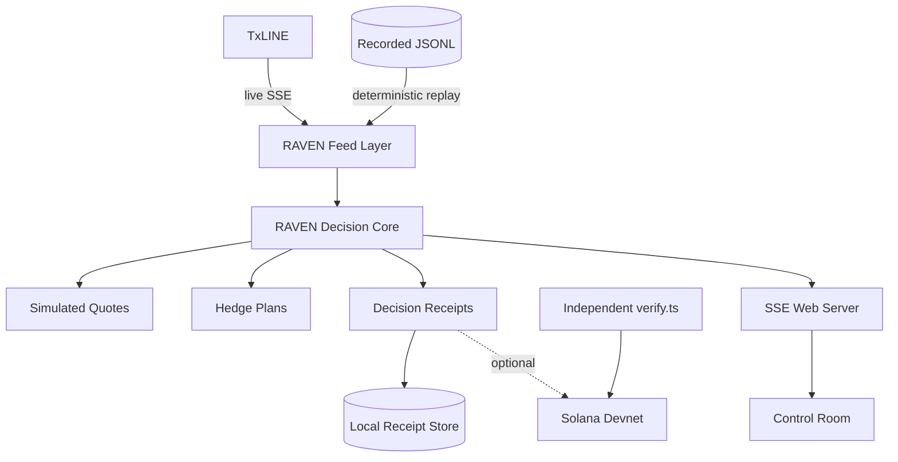
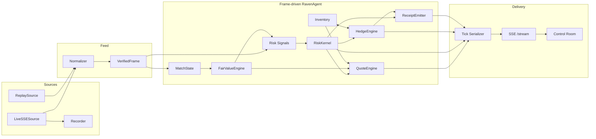
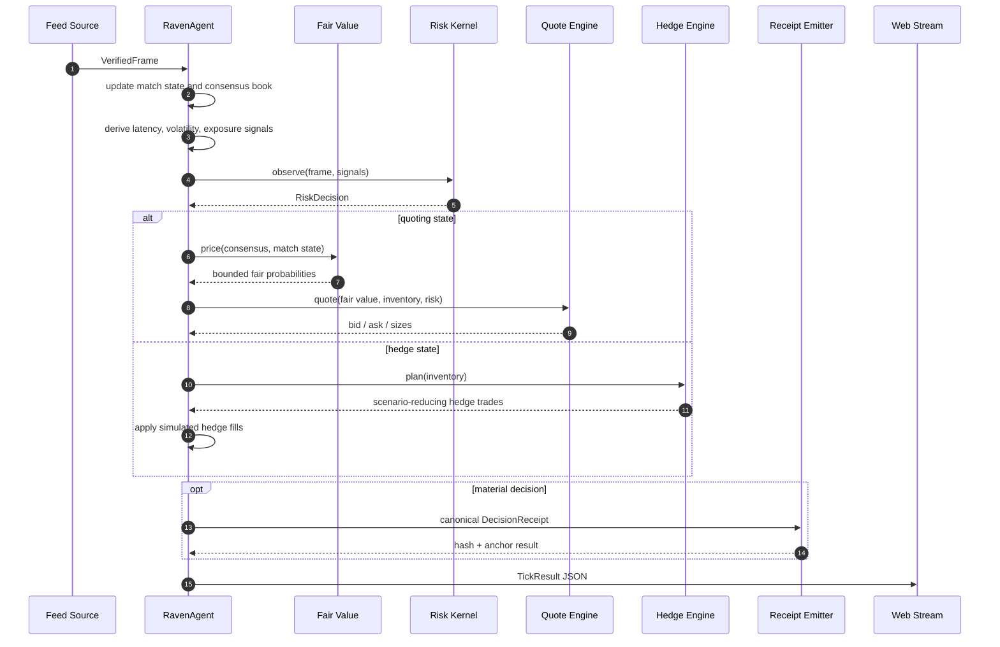
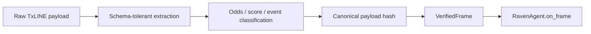
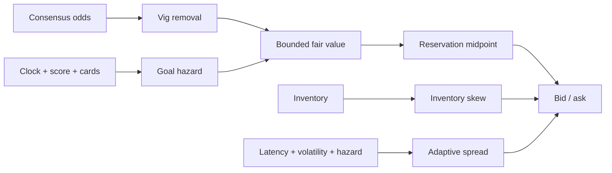
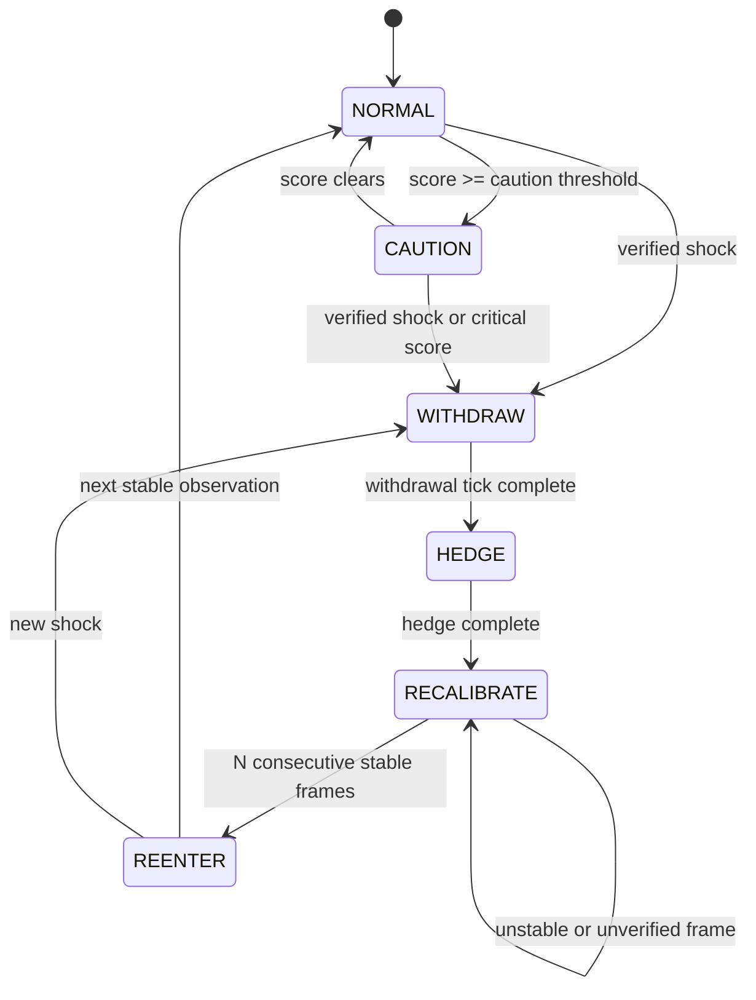
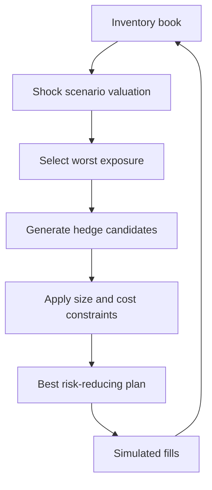
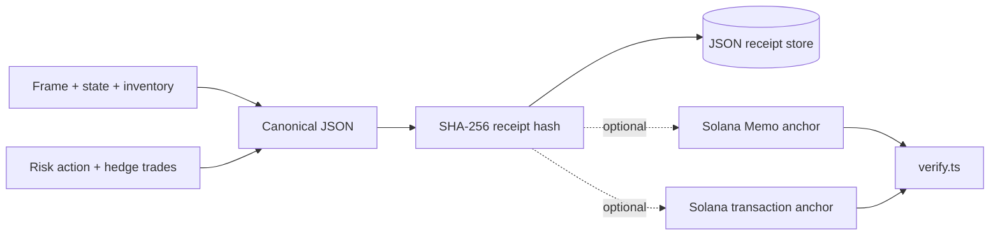

# RAVEN Architecture

This document describes the implemented architecture of RAVEN: its runtime
boundaries, decision path, state transitions, receipt model, and deployment topology.

## Design Goals

1. React to live football shocks without relying on manual intervention.
2. Keep pricing, risk, and hedging deterministic and independently testable.
3. Treat correlated markets as one portfolio rather than isolated books.
4. Preserve enough provenance to reproduce and audit material decisions.
5. Run the same decision pipeline against live and recorded TxLINE frames.

## System Context



The core does not know whether a frame came from the network or a recording, and
it does not know whether a receipt uses a null, memo, or Solana transaction anchor.
Those boundaries are injected around the deterministic decision path.

## Component Architecture



## Per-Frame Decision Sequence



## Feed and Provenance

`raven/feed/` converts heterogeneous upstream payloads into `VerifiedFrame`, the
only input understood by the decision core. A frame carries normalized match data
alongside sequence, timestamp, payload hash, and optional Solana validation reference.



The replay source preserves ordering and feeds recorded bytes through normalization.
This is the basis for reproducible demos after a live fixture has ended.

## Pricing Pipeline

For decimal odds $o_i$, raw implied probability is $1/o_i$. Multiplicative vig
removal normalizes the book:

$$p_i^{market} = \frac{1/o_i}{\sum_j 1/o_j}$$

The hazard model estimates remaining home and away goal intensities using match
clock, score, and red-card state. Outcome probabilities are evaluated from truncated
Poisson goal distributions. The final model probability is capped around the market
probability:

$$p_i^{fair} = \operatorname{clip}(p_i^{model},
 p_i^{market}-\delta_{max}, p_i^{market}+\delta_{max})$$

The quote engine then applies inventory skew and risk-sensitive spread widening:



## Risk Kernel

The risk kernel is the sole owner of market posture. Its output determines whether
RAVEN may quote, must stand aside, or must hedge.



Quoting is allowed only in `NORMAL`, `CAUTION`, and `REENTER`. It is disabled in
`WITHDRAW`, `HEDGE`, and `RECALIBRATE`.

The normalized score is:

$$R = 0.30D + 0.25L + 0.20I + 0.15E + 0.10C$$

| Signal | Meaning |
| --- | --- |
| $D$ | fair-value deviation relative to the model cap |
| $L$ | feed gap relative to the latency budget |
| $I$ | linked-market incoherence or its runtime proxy |
| $E$ | worst shock exposure relative to the hedge budget |
| $C$ | degraded feed confidence |

## Cross-Market Hedging

The hedge engine evaluates the whole inventory under explicit event scenarios such
as home goal, away goal, home red card, and no-more-goals. It searches available
cross-market actions and prefers plans that reduce the worst scenario loss after
transaction-cost penalties and trade-size limits.



This is intentionally an execution-neutral boundary. The prototype applies simulated
fills; a production adapter would translate `HedgeTrade` objects into authenticated
venue orders and reconcile acknowledgements before declaring completion.

## Decision Receipts

Receipts turn material decisions into content-addressed audit records.



The local/demo default is a `NullAnchor`: receipts and hashes still exist, but no
claim of on-chain settlement is made. Devnet anchoring is opt-in through the provided
anchor implementations. This keeps offline replay deterministic and removes wallet
availability from the core decision loop.

## Web and Deployment Topology

```mermaid
flowchart TB
    subgraph Render[Render Web Service]
      DATA[(Packaged replay)] --> DRIVER[Replay Driver]
      DRIVER --> CORE[RAVEN Agent]
      CORE --> SERVER[Python HTTP + SSE server]
      SERVER --> HEALTH[/healthz]
      SERVER --> STREAM[/stream]
    end

    subgraph Vercel[Vercel Static Deployment]
      CONFIG[config.js with RAVEN_API_BASE]
      APP[Control Room HTML/CSS/JS]
      CONFIG --> APP
    end

    STREAM -->|CORS-enabled EventSource| APP
    USER[Browser] --> APP
```

The split exists because SSE is a long-lived connection and is a poor fit for a
static or short-lived serverless function. Render owns the stream; Vercel serves the
frontend. `RAVEN_API_BASE` joins the two at frontend build time.

## Determinism and Side Effects

RAVEN isolates side effects at its edges:

| Deterministic core | Side-effect boundary |
| --- | --- |
| Normalization and frame classification | TxLINE network connection |
| Match-state updates | Raw frame recording |
| Fair-value and quote calculation | Receipt file persistence |
| Risk transitions | Optional Solana RPC |
| Shock exposure and hedge planning | SSE client delivery |

Given the same ordered normalized frames and initial configuration, the core is
designed to produce the same decisions. Wall-clock waiting and network anchoring are
kept outside that claim.

## Failure Behaviour

| Failure | Intended response |
| --- | --- |
| Verified critical event | Withdraw quotes before hedging |
| Feed gaps or volatility | Raise risk and widen or suspend quoting |
| Unstable post-event prices | Remain in `RECALIBRATE` |
| Browser disconnect | End that SSE handler without affecting other clients |
| Solana unavailable | Preserve local receipt; anchor result reports failure/backend |
| Render restart | Replay restarts; prototype state is process-local |

## Production Hardening

The current system is a deployable demonstration, not a production trading venue.
A production rollout should add:

- authenticated execution adapters and idempotent client order IDs
- durable inventory, receipt, and replay storage
- explicit order acknowledgement and cancellation reconciliation
- queue-backed separation between feed, decisions, execution, and UI
- restricted CORS, authentication, rate limiting, and secret management
- high-availability stream ingestion and sequence-gap recovery
- metrics, tracing, alerting, and incident runbooks
- formal model validation, venue-specific limits, and kill switches
- managed Solana signing with key rotation and retry policy

## Source Index

| Concern | Primary implementation |
| --- | --- |
| Orchestration | `raven/agent.py` |
| Frame model and normalization | `raven/feed/model.py`, `raven/feed/normalize.py` |
| Live and replay sources | `raven/feed/live.py`, `raven/feed/replay.py` |
| Fair value | `raven/pricing/fair_value.py`, `raven/pricing/hazard.py` |
| Quote construction | `raven/quoting/engine.py`, `raven/quoting/inventory.py` |
| Risk state machine | `raven/risk/kernel.py` |
| Market dependencies | `raven/risk/dependency_graph.py` |
| Flow toxicity | `raven/risk/adversarial.py` |
| Hedging | `raven/hedging/engine.py` |
| Receipts and anchors | `raven/provenance/` |
| Web delivery | `raven/web/` |

