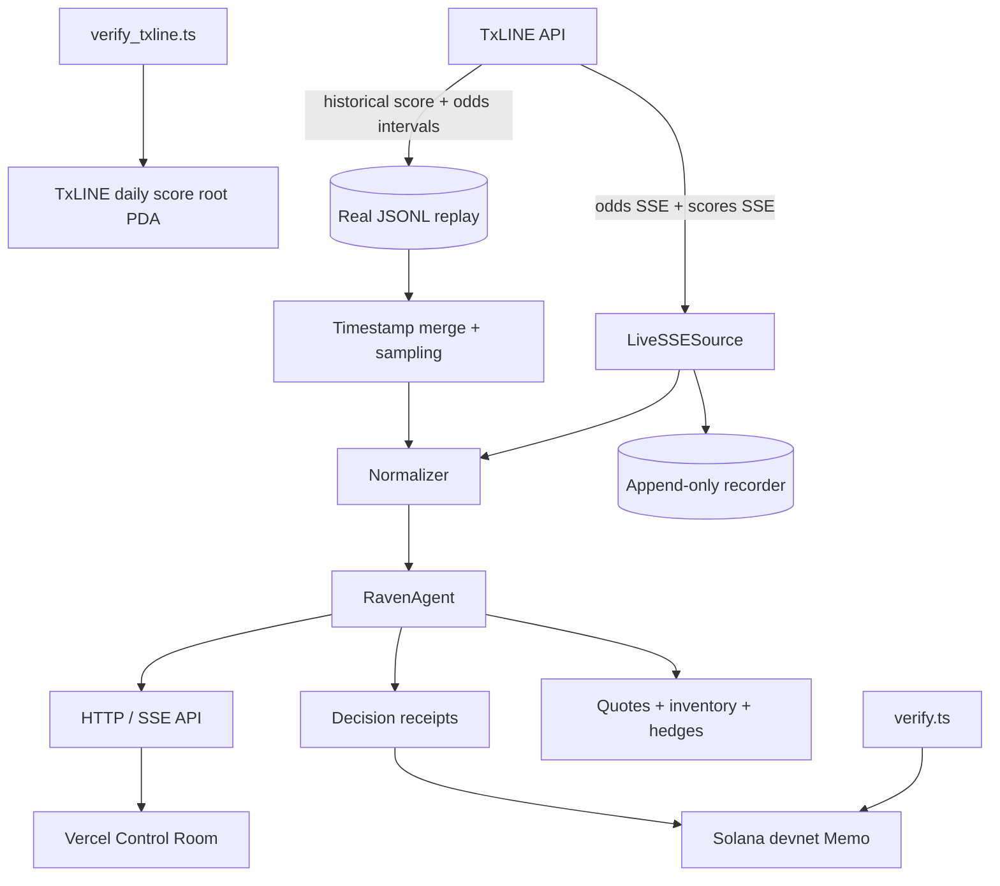
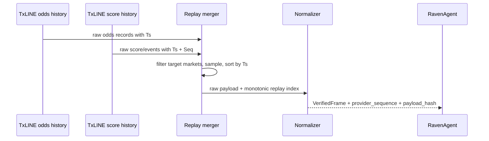
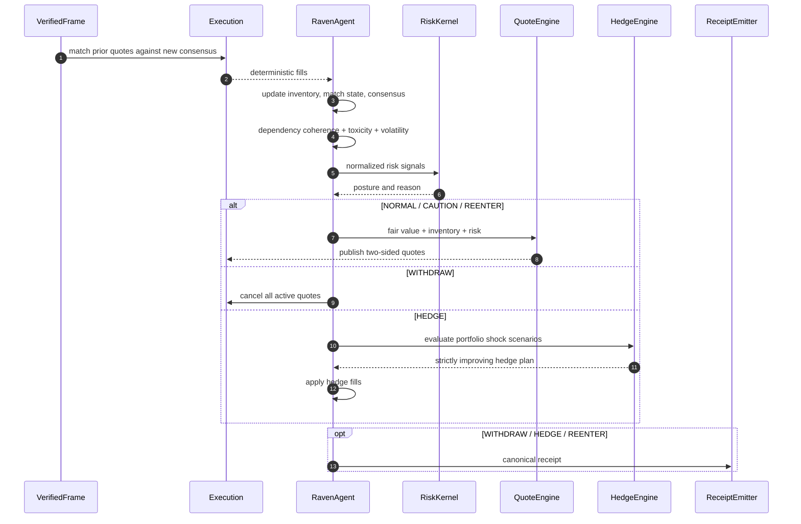
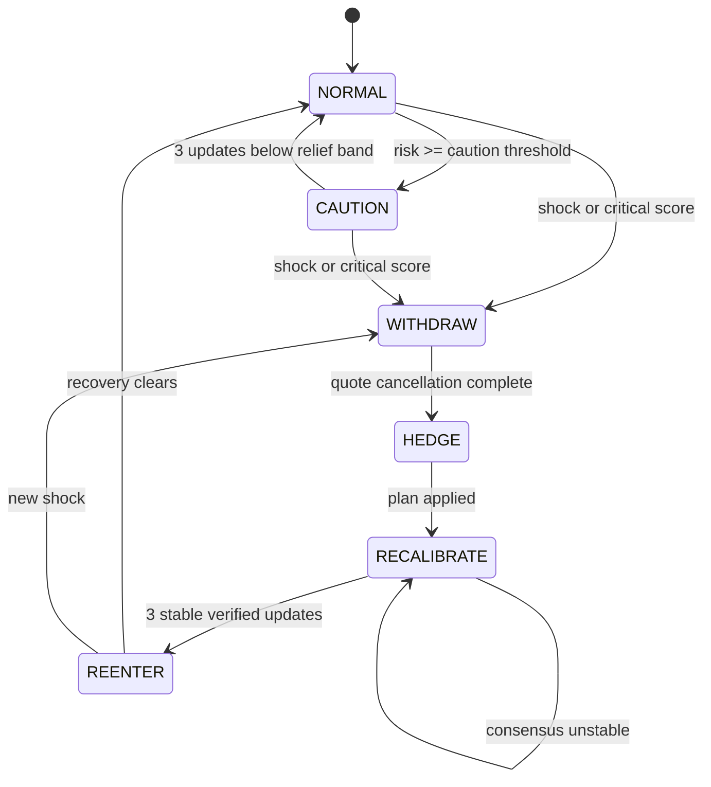
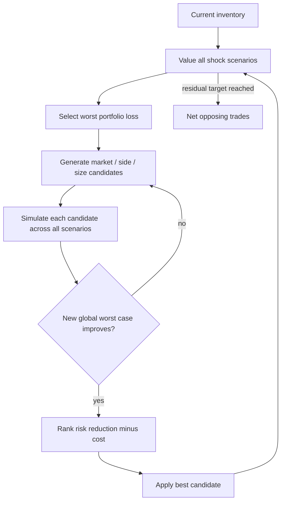
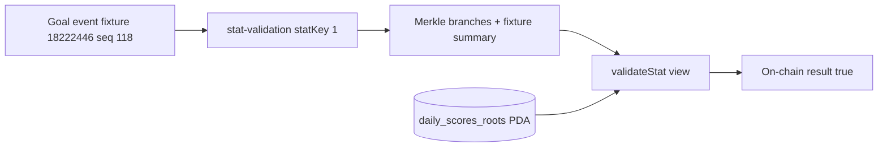
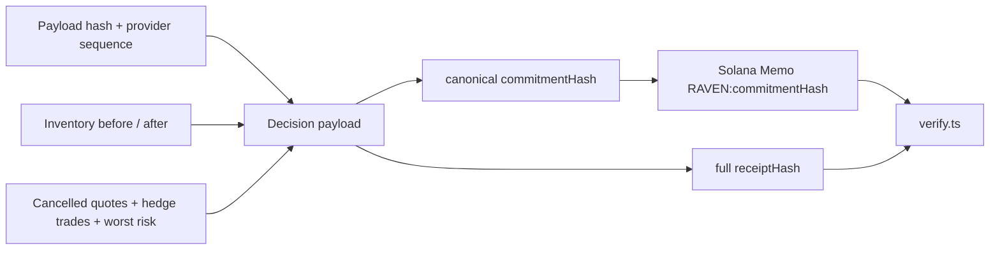
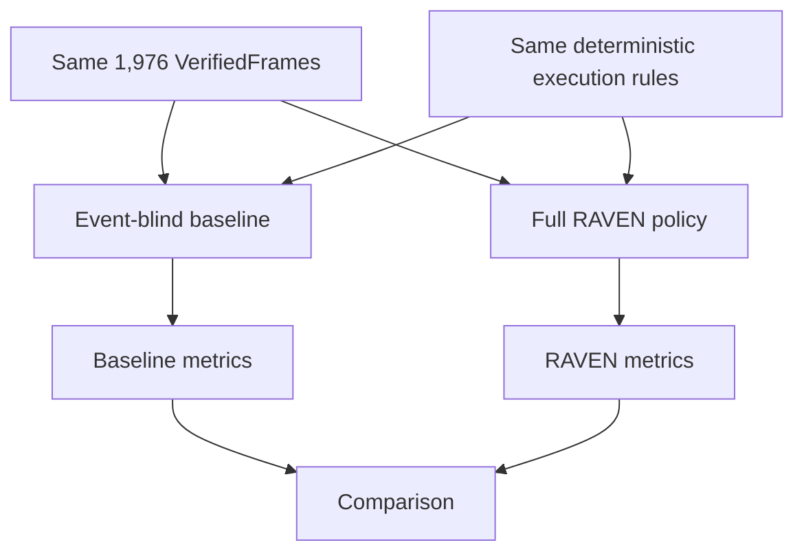

# RAVEN Architecture

This document describes the implemented runtime, not a target-state design.
RAVEN has a deterministic decision core with network, simulated execution,
persistence, Solana, and browser delivery isolated at explicit boundaries.

## System Context



TxLINE is the market-data plane. RAVEN does not claim that TxLINE accepts
orders. `SimulatedExecution` is an explicit adapter that makes inventory and
hedging observable without implying exchange connectivity.

## Runtime Layers

```mermaid
flowchart LR
    subgraph Feed
      A[LiveSSESource / ReplaySource]
      B[normalize]
      C[VerifiedFrame]
      A --> B --> C
    end

    subgraph DecisionCore[Deterministic Decision Core]
      E[SimulatedExecution]
      M[MatchState]
      D[DependencyGraph]
      T[AdversarialFlowDetector]
      F[FairValueEngine]
      R[RiskKernel]
      Q[QuoteEngine]
      I[Inventory]
      H[HedgeEngine]
      P[ReceiptEmitter]

      C --> E --> I
      C --> M --> F
      C --> D --> R
      E --> T --> R
      F --> R
      I --> R
      R --> Q
      F --> Q
      I --> Q
      R --> H
      I <--> H
      R --> P
      H --> P
    end

    subgraph Delivery
      J[Tick serializer] --> S[/stream SSE]
      S --> W[Control Room]
      K[/counterfactual JSON] --> W
    end

    Q --> J
    I --> J
    H --> J
    P --> J
```

## Source Contracts

`VerifiedFrame` is the only input accepted by the core. It carries:

| Field | Meaning |
| --- | --- |
| `sequence` | Monotonic sequence inside the merged replay/live consumer |
| `provider_sequence` | Native TxLINE `Seq`, when the endpoint provides one |
| `timestamp_ms` | Provider event timestamp |
| `payload_hash` | SHA-256 over canonical untouched provider payload |
| `solana_validation_ref` | TxLINE proof reference when independently validated |
| normalized payload | odds, score, event, clock, phase, finalization |

Historical odds interval records do not expose a native `Seq`; they retain the
payload hash and receive a monotonic replay sequence. Historical scores preserve
their native TxLINE sequence separately. This avoids mixing two sequence domains.



The packaged fixture contains 8,375 downloaded odds records. The web driver
selects changing full-match 1X2, AH `-0.5`, and O/U `2.5` snapshots at a stable
cadence, merges enriched score events, and produces 1,976 frames.

Feed latency is measured as provider timestamp lateness against the latest
observed watermark. A normal gap between ordered market updates is cadence, not
transport latency; only stale or out-of-order frames add latency risk. This
keeps the live and replay semantics deterministic without trapping recovery on
sparse historical updates.

## Live Ingestion

`LiveSSESource` maintains separate odds and scores stream tasks and merges them
through an async queue. Both use the documented headers. A `401` obtains a fresh
guest JWT and reconnects with bounded backoff. Every received payload is written
before normalization.

```mermaid
flowchart LR
    AUTH[Guest JWT + X-Api-Token] --> ODDS[/api/odds/stream]
    AUTH --> SCORES[/api/scores/stream]
    ODDS --> QUEUE[Async merge queue]
    SCORES --> QUEUE
    QUEUE --> RECORD[Recorder]
    RECORD --> NORMALIZE[Normalizer]
```

## Per-Frame Sequence



Shock frames do not fill quotes. The withdrawal reflex wins the race before the
matching adapter can create a fill on that event.

## Pricing and Quoting

For decimal odds $o_i$, multiplicative vig removal is:

$$
p_i^{market}=\frac{1/o_i}{\sum_j 1/o_j}
$$

The score-, clock-, and red-card-aware hazard model produces model probabilities.
Model risk is capped around consensus:

$$
p_i^{fair}=\operatorname{clip}\left(p_i^{model},
p_i^{market}-\delta_{max},p_i^{market}+\delta_{max}\right)
$$

The quote midpoint shifts against inventory. Half-spread widens additively with
event hazard, feed latency, volatility, and cross-market incoherence. Fractional
Kelly controls size only. At the per-outcome position limit, RAVEN removes only
the quote side that would increase exposure and keeps the inventory-reducing
side live.

## Deterministic Execution

The execution adapter owns the currently published quote book.

1. A new real consensus probability crossing an ask or bid creates a fill.
2. Otherwise, low-rate passive flow is selected from the immutable payload hash.
3. Shock frames never fill.
4. Fill side, size, price, and reason are written to `TickResult`.
5. Inventory changes before the next risk decision.

There is no RNG and no wall-clock dependency, so identical frames generate
identical fills and inventory hashes.

## Risk Kernel

The posture score is:

$$
R=0.30D_{consensus}+0.25L_{event}+0.20I_{cross-market}
+0.15E_{portfolio}+0.10C_{feed}
$$

`I` is the maximum of observed volatility, dependency-graph incoherence, and
flow toxicity. A verified goal/red-card/penalty/VAR shock bypasses the blended
threshold and forces `WITHDRAW`.

`CAUTION` uses hysteresis rather than a single-edge comparison: it returns to
`NORMAL` only after three consecutive shock-free updates below
`caution_threshold - caution_relief`. This prevents alternating market frames
near the threshold from causing posture flapping. The Control Room applies a
separate presentation filter and records transitions, shocks, receipts, hedge
actions, and periodic checkpoints instead of rendering every input frame.
For demo observability, the SSE presentation layer holds critical transition
frames for 0.7-0.9 seconds; this does not alter decision order, timestamps,
receipt hashes, or counterfactual results.



## Cross-Market Hedge Search

Inventory is revalued under `HOME_GOAL`, `AWAY_GOAL`, `RED_CARD_HOME`, and
`NO_MORE_GOALS`. Candidate trades come from the latest published quotes across
all observed markets.



Testing the full post-trade portfolio prevents a hedge that repairs one shock
while creating a larger loss in another. The integration suite asserts strict
worst-case improvement for every emitted hedge.

## Proof Architecture

### TxLINE data proof



`verify_txline.ts` uses TxLINE's official devnet IDL and program
`6pW64...wyP2J`. The checked artifact proves stat `1 == 1` for score sequence
`118` against PDA `FtnZ...92HdH`. It is a read-only Solana simulation.

### RAVEN decision proof



`marketStateHash` is the source payload hash; it is not overloaded as a receipt
commitment. `commitmentHash` covers every decision field. `receiptHash` covers
the decision plus its commitment. The verifier reconstructs both and requires
the complete commitment in the Memo.

The deployed browser has no signer. `ArchiveAnchor` matches deterministic replay
receipts to four public pre-anchored proofs only when both hashes match.

## Counterfactual Isolation



The baseline deliberately keeps static spreads and no practical inventory cap;
RAVEN adds bounded inventory, adaptive spreads, event withdrawal, and hedging.
Both use the same normalized frames and deterministic matching adapter.

The control policy always remains `NORMAL`, uses a static spread, and never
hedges. It shares normalization, fair value, quote contracts, inventory, and
execution with RAVEN. This isolates the risk policy rather than comparing two
unrelated simulators.

## Deployment

```mermaid
flowchart TB
    subgraph Render
      D[(Replay + public proofs)] --> PY[Python decision core]
      PY --> H[/healthz]
      PY --> C[/counterfactual]
      PY --> S[/stream SSE]
    end
    subgraph Vercel
      CFG[Generated config.js] --> SPA[Static landing + Control Room]
    end
    S -->|CORS EventSource| SPA
    C -->|measured evidence| SPA
    U[Judge browser] --> SPA
```

Render owns long-lived SSE. Vercel serves immutable static assets and injects
`RAVEN_API_BASE` at build time. The replay deployment needs no secret.

## Failure Behavior

| Failure | Response |
| --- | --- |
| TxLINE `401` | Refresh guest JWT and reconnect |
| Stream disconnect | Bounded reconnect backoff; raw recorder remains append-only |
| Shock frame | Cancel quotes before hedging; no event-frame fill |
| Linked markets disagree | Increase incoherence risk and widen/withdraw |
| Toxic fill burst | Increase toxicity risk and shorten/widen quotes |
| Hedge candidate worsens another shock | Reject candidate |
| Solana write fails | Decision continues; local hash remains, anchor reports failure |
| Browser disconnects | End only that SSE handler |
| Render restarts | New deterministic replay session |

## Test Invariants

- packaged replay is multi-market, monotonic, and bound to one fixture
- same frames produce identical states, fills, hedges, and receipt hashes
- inventory changes only through explicit fills and hedge trades
- every emitted hedge strictly reduces absolute worst-case loss
- active withdrawals report a non-zero cancelled quote count
- exactly four current replay receipts match public devnet signatures
- native TxLINE score proof returns true against the official devnet program
- counterfactual agents process the same frame count

## Production Boundary

The current execution adapter is simulated. Production deployment additionally
requires venue-specific order gateways, idempotent client IDs, durable event and
inventory stores, cancel/replace acknowledgement, reconciliation, queue-backed
work isolation, authentication, restricted CORS, high-availability ingestion,
sequence-gap recovery, metrics and alerts, managed signing, formal model review,
exposure limits, and operator kill switches.
