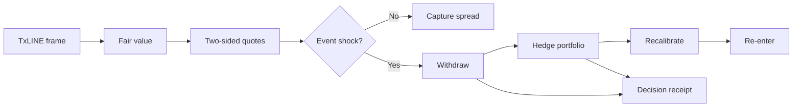
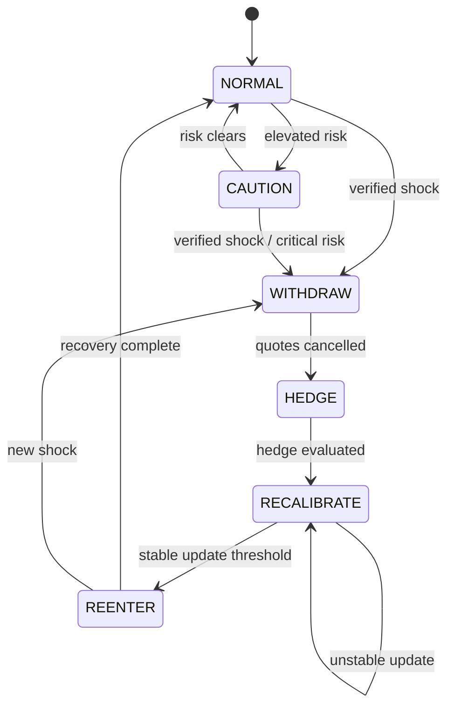

<p align="center">
  
</p>

<h1 align="center">RAVEN</h1>

<p align="center">
  <strong>Real-time Autonomous Verifiable Exposure Neutralizer</strong><br />
  An event-aware market-making agent built to survive live football market shocks.
</p>

<p align="center">
  <a href="ARCHITECTURE.md"><strong>Architecture</strong></a> ·
  <a href="DEMO_SCRIPT.md"><strong>Demo script</strong></a> ·
  <a href="https://raven-backend-xc2x.onrender.com/healthz"><strong>Backend health</strong></a>
</p>

> Most market makers earn until the match changes. RAVEN is built for the moment it does.

RAVEN consumes TxLINE football data, continuously derives fair probabilities and
two-sided quotes, and monitors the portfolio through a deterministic risk state
machine. When a goal, red card, penalty, or VAR shock arrives, RAVEN withdraws,
computes a cross-market hedge, waits for stable updates, and re-enters. Material
decisions produce canonical, hash-addressed receipts that can optionally be anchored
to Solana devnet.

Built for the **Trading Tools and Agents** track of the TxODDS World Cup Hackathon 2026.

## Why RAVEN

Live football markets are coupled. A goal does not move only Match Winner; it can
reprice Asian Handicap, Total Goals, Correct Score, and adjacent markets at once.
A static market maker can leave stale liquidity exposed precisely when informed flow
is fastest.

RAVEN treats this as a portfolio-control problem:

| Mode | Behaviour |
| --- | --- |
| **Earn** | Remove vig, estimate bounded fair value, and quote both sides with inventory-aware spreads. |
| **Survive** | Detect verified shocks, cancel exposure, hedge the connected book, and suspend quoting. |
| **Recover** | Require consecutive stable frames before widening back into the market. |
| **Prove** | Emit deterministic decision receipts with feed sequence, state hashes, action, reason, and hedge details. |

## Demo Flow

The deployed Control Room replays a recorded TxLINE match through the same agent
pipeline used by live mode.



During the demo, watch four things:

1. The state badge and risk score during normal quoting.
2. Quotes disappear immediately when a critical event is processed.
3. The state advances through `WITHDRAW`, `HEDGE`, `RECALIBRATE`, and `REENTER`.
4. The receipt feed records why the action happened and which TxLINE sequence caused it.

The ready-to-read English narration is in [DEMO_SCRIPT.md](DEMO_SCRIPT.md).

## System at a Glance

```text
TxLINE Live SSE / Recorded Replay
                 |
          normalize + verify
                 |
     fair value + hazard model
                 |
       deterministic risk kernel
          /              \
   quote engine       hedge engine
          \              /
       inventory + decision receipt
                 |
        SSE Control Room API
                 |
          Vercel frontend
```

For component boundaries, sequence diagrams, state transitions, invariants, and
deployment topology, see **[ARCHITECTURE.md](ARCHITECTURE.md)**.

## Core Capabilities

- Live TxLINE SSE ingestion and byte-preserving recording
- Deterministic replay of captured match data
- Multiplicative and Shin vig removal
- Score-, clock-, and event-aware Poisson hazard pricing
- Bounded deviation from market consensus
- Inventory-skewed bid/ask generation and adaptive spread controls
- Weighted risk kernel with explicit market postures
- Cross-market dependency and stale-market detection primitives
- Scenario-based portfolio hedging across connected outcomes
- Adversarial flow detection primitives
- Canonical SHA-256 decision receipts
- Optional Solana Memo or transaction anchoring
- Independent TypeScript receipt verifier
- Browser Control Room streamed over Server-Sent Events
- Counterfactual comparison against an event-blind baseline

## Risk State Machine



The risk score is a bounded blend of normalized signals:

$$
R = 0.30D_{consensus} + 0.25L_{event} + 0.20I_{cross-market}
  + 0.15E_{portfolio} + 0.10C_{feed}
$$

This score controls posture; a verified critical event can force withdrawal
independently of the blended score.

## Repository Map

| Path | Responsibility |
| --- | --- |
| `raven/feed/` | Live SSE, normalization, provenance, recording, and replay |
| `raven/pricing/` | Vig removal, match state, hazard model, and fair value |
| `raven/quoting/` | Inventory and two-sided quote construction |
| `raven/risk/` | State machine, dependency graph, and flow toxicity |
| `raven/hedging/` | Shock exposure and cross-market hedge planning |
| `raven/provenance/` | Canonical receipts, local store, and Solana anchors |
| `raven/web/` | Replay driver, JSON serialization, SSE server, and frontend |
| `raven/counterfactual.py` | Baseline-versus-RAVEN replay comparison |
| `verify.ts` | Independent Solana receipt verification |
| `tests/` | Deterministic unit tests for normalization and risk behaviour |

## Run Locally

### Requirements

- Python 3.11+
- Node.js 18+ only for the TypeScript verifier

```bash
git clone https://github.com/karagozemin/RAVEN.git
cd RAVEN
python3 -m venv .venv
source .venv/bin/activate
pip install -r requirements.txt
```

Start the self-contained web demo:

```bash
python -m raven.web
```

Open `http://localhost:8787`. The packaged replay requires no API key or wallet.

Run the deterministic pipeline smoke test and tests:

```bash
python -m raven.main --smoke
python -m pytest -q
```

Build the frontend exactly as Vercel does:

```bash
RAVEN_API_BASE=http://localhost:8787 bash scripts/build_frontend.sh
```

## Live TxLINE Mode

Copy `.env.example` to `.env`, set the TxLINE endpoint and credentials, then use
the live source configuration. Live ingestion records raw frames so the same input
can later be replayed deterministically.

Important environment variables:

| Variable | Purpose |
| --- | --- |
| `RAVEN_FEED_MODE` | `live` or `replay` |
| `TXLINE_SSE_URL` | TxLINE SSE endpoint |
| `TXLINE_API_KEY` | TxLINE bearer credential |
| `TXLINE_SERVICE_LEVEL` | Requested TxLINE service tier |
| `RAVEN_RECORD_DIR` | Raw frame recording directory |
| `RAVEN_REPLAY_FILE` | Recording used in replay mode |
| `RAVEN_REPLAY_SPEED` | Replay acceleration factor |

Secrets and local recordings are excluded from Git.

## Decision Receipts

RAVEN emits a receipt only for material actions such as a state transition,
withdrawal, or hedge. Ordinary quote refreshes are not individually anchored.

Each receipt binds together:

- policy version and action reason
- fixture and TxLINE sequence
- source market-state hash
- previous and next risk states
- risk score and cancelled quote count
- inventory hashes and hedge trades
- execution timestamp

The default local/demo emitter stores receipts with a null anchor so the system
runs without a wallet. `MemoAnchor` and `SolanaAnchor` provide devnet-backed
implementations when configured. Verify an anchored transaction with:

```bash
npm install
npx ts-node verify.ts <SOLANA_TRANSACTION_SIGNATURE>
```

## Deploy

RAVEN uses a split deployment because the backend holds long-lived SSE connections.

### Render backend

Create a Render Web Service from this repository. `render.yaml` defines:

```text
Build:  pip install -r requirements.txt
Start:  python -m raven.web
Health: /healthz
```

Current backend health endpoint:
`https://raven-backend-xc2x.onrender.com/healthz`

### Vercel frontend

Import the same repository with Framework Preset `Other`, then set:

```text
RAVEN_API_BASE=https://raven-backend-xc2x.onrender.com
```

`vercel.json` runs `scripts/build_frontend.sh` and publishes `public/`. Redeploy
Vercel whenever `RAVEN_API_BASE` changes because the value is injected at build time.

## Engineering Principles

- **Deterministic decisions:** identical ordered frames produce identical state transitions.
- **Fail closed on shocks:** RAVEN removes liquidity before attempting recovery.
- **Bounded model risk:** model output cannot drift arbitrarily far from consensus.
- **Separation of concerns:** feed, pricing, risk, execution, proof, and transport are replaceable boundaries.
- **Auditability over narration:** receipts capture inputs and actions; an LLM is not in the decision loop.
- **Demo fidelity:** replay enters the same normalized frame and agent pipeline as live input.

## Scope

RAVEN is a hackathon prototype and simulation environment. It does not place
real-money bets or claim production exchange connectivity. Production use would
require authenticated execution adapters, persistent shared state, durable queues,
reconciliation, monitoring, key management, and a formal risk review.
