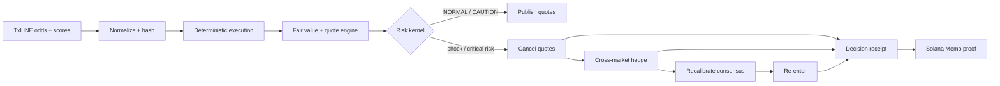
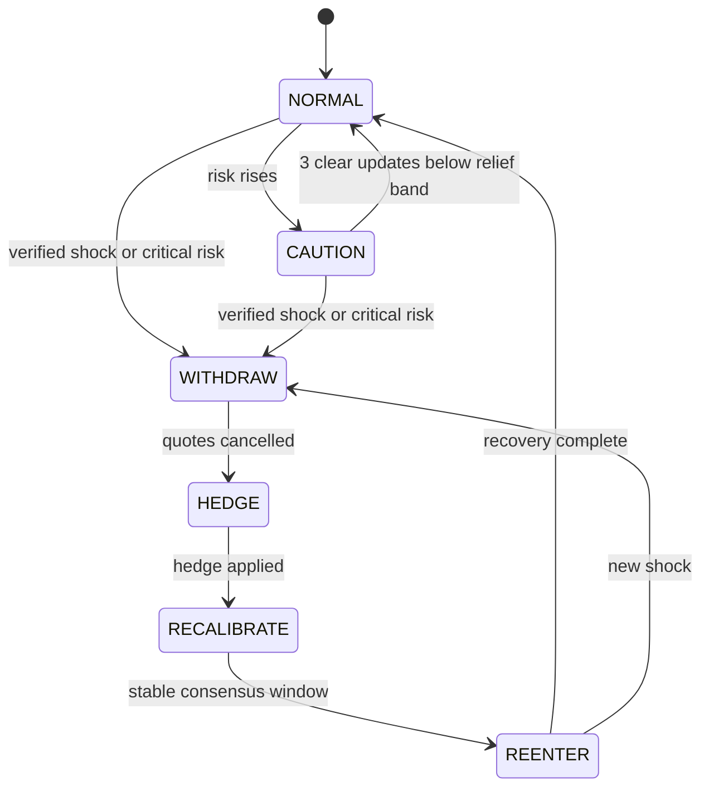
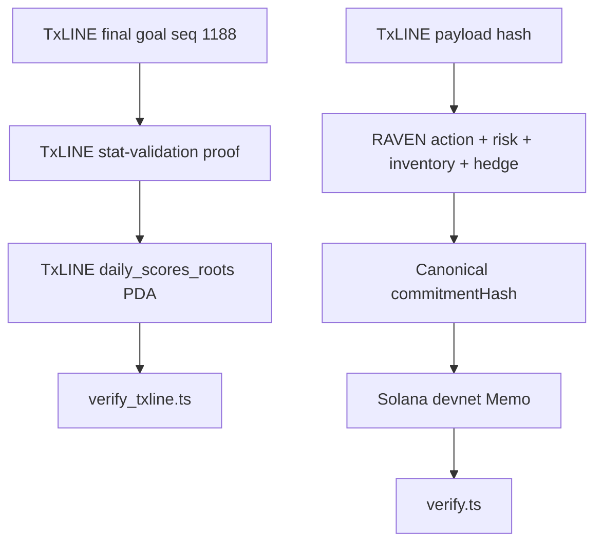

<p align="center">
  
</p>

<h1 align="center">RAVEN</h1>

<p align="center">
  <strong>Real-time Autonomous Verifiable Exposure Neutralizer</strong><br />
  An autonomous, event-aware market maker powered by TxLINE.
</p>

<p align="center">
  <a href="ARCHITECTURE.md"><strong>Architecture</strong></a> ·
  <a href="DEMO_SCRIPT.md"><strong>Demo script</strong></a> ·
  <a href="https://raven-blond.vercel.app"><strong>Live app</strong></a> ·
  <a href="https://raven-backend-xc2x.onrender.com/healthz"><strong>API health</strong></a>
</p>

> Most market makers earn until the match changes. RAVEN is built for the moment it does.

RAVEN consumes real-time odds, scores, and match events from TxLINE; derives
bounded fair value; publishes inventory-aware two-sided quotes; and continuously
tests the connected portfolio against event shocks. It withdraws vulnerable
quotes, executes deterministic cross-market hedges, waits for stable consensus,
and re-enters without manual intervention.

Every material decision is bound to the exact source payload and inventory state.
Four representative decisions are anchored to Solana devnet, and a native
TxLINE score event is independently validated against TxLINE's on-chain Merkle
root.

Built for the **Trading Tools and Agents** track of the TxODDS World Cup Hackathon 2026.

## What Is Real

| Surface | Implementation |
| --- | --- |
| Market data | Real TxLINE World Cup Final odds, scores, and events for fixture `18257739` |
| Live ingestion | Authenticated TxLINE odds and scores SSE clients with reconnect and JWT refresh |
| Markets | Match Winner, Asian Handicap `-0.5`, Total Goals `2.5` |
| Execution | Deterministic simulated matching; TxLINE is a data provider, not an execution venue |
| Inventory | Fill-driven, mutable position book used by quoting and hedging |
| Decisions | Production `RavenAgent` pipeline in both live and replay modes |
| Proofs | TxLINE Merkle proof + RAVEN Solana Memo decision receipts |

The web demo is a replay because the reviewed match has ended. It does not
generate odds or alter downloaded prices. Historical and live frames enter the
same normalizer and decision core.

The packaged replay is the FIFA World Cup 2026 Final: **Spain 1-0 Argentina**.
It includes regulation and extra-time TxLINE markets, Ferran Torres's verified
winner at `105:39` (`106'`), and the finalization event at `120:24`.

## Measured Replay

Both policies below process the same ordered `2,499` real TxLINE frames. The
baseline always quotes a static spread with no practical inventory cap and
never hedges. RAVEN runs the full risk policy. Execution and matching are
identical for both.

| Metric | Event-blind baseline | RAVEN |
| --- | ---: | ---: |
| Deterministic fills | 4,622 | 2,986 |
| Quotes cancelled | 0 | 14 |
| Hedge trades | 0 | 3 |
| Peak worst-case shock loss | 7,801.31 | 391.85 |
| Final worst-case shock loss | 5,510.21 | 32.29 |
| Manual interventions required | 1 | 0 |

**Peak worst-case risk reduction: 94.98%.** These values are calculated by
`raven/counterfactual.py`; they are not hard-coded P&L claims.

```bash
python -m raven.counterfactual
```

## Decision Flow



The risk lifecycle is explicit:



For system boundaries, data contracts, proof paths, and deployment topology,
read **[ARCHITECTURE.md](ARCHITECTURE.md)**.

## Core Capabilities

- Dual authenticated TxLINE SSE ingestion: odds and scores
- Byte-preserving live recording and raw historical JSONL replay
- Native TxLINE 1X2, Asian Handicap, and Over/Under normalization
- Multiplicative and Shin vig removal
- Score-, clock-, and event-aware goal-hazard pricing
- Consensus deviation caps and inventory-skewed quotes
- Deterministic fills from real consensus crossings and payload-derived passive flow
- Cross-market dependency graph and adversarial flow toxicity signal
- Six-state autonomous risk kernel
- Portfolio shock scenarios and worst-case-improving hedge selection
- Canonical decision receipts with source and inventory hashes
- Public Solana devnet Memo anchors and an independent verifier
- Native TxLINE score-stat validation against its devnet Anchor program
- Same-engine counterfactual comparison
- Responsive SSE Control Room with browser history and animated view transitions

## Repository Map

| Path | Responsibility |
| --- | --- |
| `raven/feed/` | Live SSE, recording, normalization, provenance, replay |
| `raven/execution/` | Deterministic quote matching and fills |
| `raven/pricing/` | Vig removal, match state, hazard model, fair value |
| `raven/quoting/` | Inventory and two-sided quote construction |
| `raven/risk/` | State machine, dependency graph, flow toxicity |
| `raven/hedging/` | Portfolio shock exposure and hedge planning |
| `raven/provenance/` | Receipt schema, stores, Memo/archive anchors |
| `raven/web/` | Merged replay, serialization, HTTP/SSE API, frontend |
| `raven/counterfactual.py` | Same-input baseline vs RAVEN comparison |
| `verify.ts` | RAVEN receipt and Solana Memo verifier |
| `verify_txline.ts` | Native TxLINE on-chain score proof verifier |
| `tests/` | Unit and full real-replay integration tests |

## Run Locally

Requirements: Python 3.11+ and Node.js 20+.

```bash
git clone https://github.com/karagozemin/RAVEN.git
cd RAVEN
python3 -m venv .venv
source .venv/bin/activate
pip install -r requirements.txt
npm install
```

Start the Control Room:

```bash
python -m raven.web
```

Open `http://localhost:8787`, enter the Control Room, and press **Run replay**.
The packaged demo requires no TxLINE key or wallet.

Run the full verification suite:

```bash
python -m pytest -q
python -m raven.counterfactual
npm run verify -- --label hedge
npm run verify:txline
```

`verify:txline` performs a read-only Solana simulation and needs any funded
devnet keypair via `SOLANA_KEYPAIR_PATH`. It does not submit a transaction.

## Live TxLINE Mode

Copy `.env.example` to `.env` and configure:

| Variable | Purpose |
| --- | --- |
| `RAVEN_FEED_MODE` | `live` or `replay` |
| `TXLINE_SSE_URL` | API base, for example `https://txline-dev.txodds.com/api` |
| `TXLINE_API_TOKEN` | Value sent in `X-Api-Token` |
| `TXLINE_JWT` | Guest Bearer JWT; refreshed automatically after `401` |
| `RAVEN_RECORD_DIR` | Append-only raw live capture directory |
| `RAVEN_REPLAY_FILE` | Real recording or packaged score history |
| `RAVEN_REPLAY_SPEED` | Replay acceleration factor |
| `SOLANA_KEYPAIR_PATH` | Optional local devnet signer path |

```bash
RAVEN_FEED_MODE=live python -m raven.main
```

The live client opens both documented streams:

- `/api/odds/stream`
- `/api/scores/stream`

Both requests use `Authorization: Bearer <guest JWT>` and `X-Api-Token`.
Credentials and wallet files are gitignored.

## Proof Model

RAVEN exposes two independent proof chains:



The public archive `receipts/anchored_demo.json` contains four deterministic
proofs: quote withdrawal, cross-market hedge, the native-verified goal response,
and controlled re-entry. The web
runtime has no private key; `ArchiveAnchor` returns a signature only when the
current replay commitment and full receipt hash match the pre-anchored record.

Verify each proof:

```bash
npm run verify -- --label withdraw
npm run verify -- --label hedge
npm run verify -- --label txline_goal_withdraw
npm run verify -- --label reenter
```

The verifier checks required fields, policy version, source payload hash,
canonical decision commitment, full receipt hash, complete Solana Memo, and
numeric hedge risk reduction.

## Deploy

The app is split because the replay stream is a long-lived SSE response.

### Render backend

1. Choose **New > Blueprint** and select this repository.
2. Render reads `render.yaml`.
3. Confirm `/healthz` returns `{"status":"ok"}`.

```text
Build:  pip install -r requirements.txt
Start:  python -m raven.web
Health: /healthz
```

### Vercel frontend

1. Import the same repository and choose framework preset **Other**.
2. Add `RAVEN_API_BASE=https://raven-backend-xc2x.onrender.com`.
3. Deploy. `vercel.json` runs `scripts/build_frontend.sh` and publishes `public/`.

No TxLINE credential or Solana private key belongs in Vercel or Render for the
packaged replay. Redeploy Render first, then Vercel, after backend contract changes.

## Scope

RAVEN is a hackathon-grade autonomous trading simulation, not a real-money
betting venue. TxLINE supplies market data; deterministic execution models fills
against RAVEN quotes. Production use requires authenticated venue adapters,
durable order/inventory state, cancel acknowledgement, reconciliation, rate
limits, managed signing, monitoring, formal model validation, and operator kill
switches.
